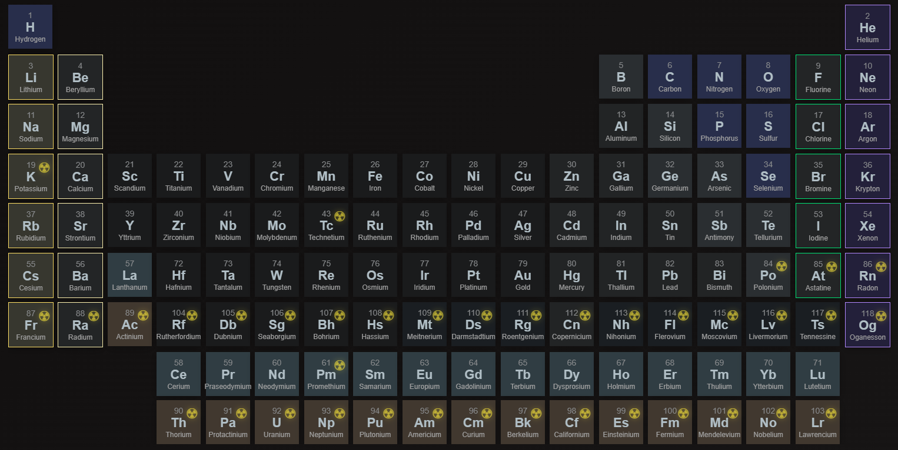
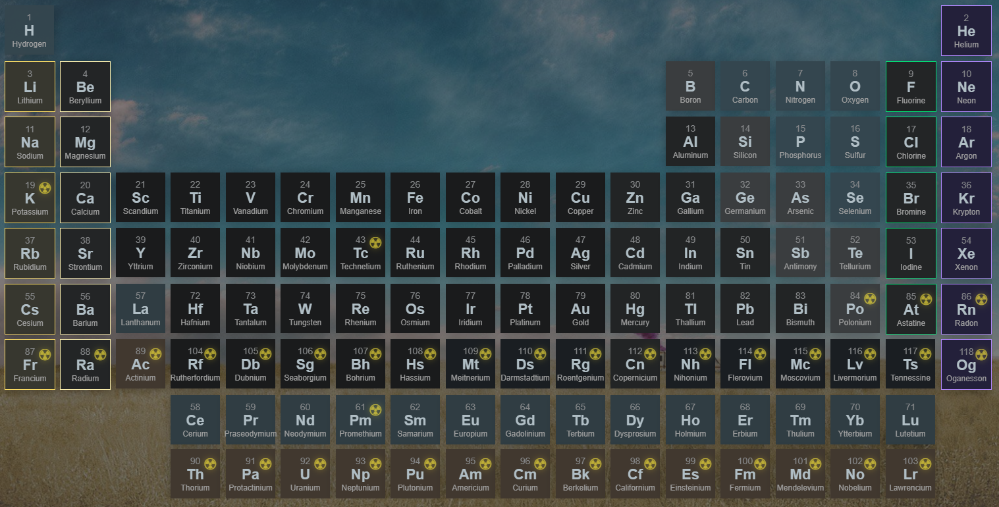
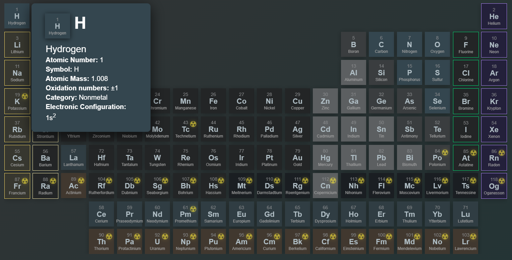

# Periodic Table of Elements

Non professional user made periodic table of elements

#Todo (will update when every one is checked)
- add periods and groups without ruining the stlyes (done)
- add advanced properties (done)
- add isotopes table
- add basic explanation pages(2/8)
- add costumization layer with local saves (half done)
- add mobile support (done)
#Todo maybe
- Elements API (node js)
- add more external languages (Русский, Spanish) 

## License
Of course this is under MIT license.
[MIT](LICENSE)
