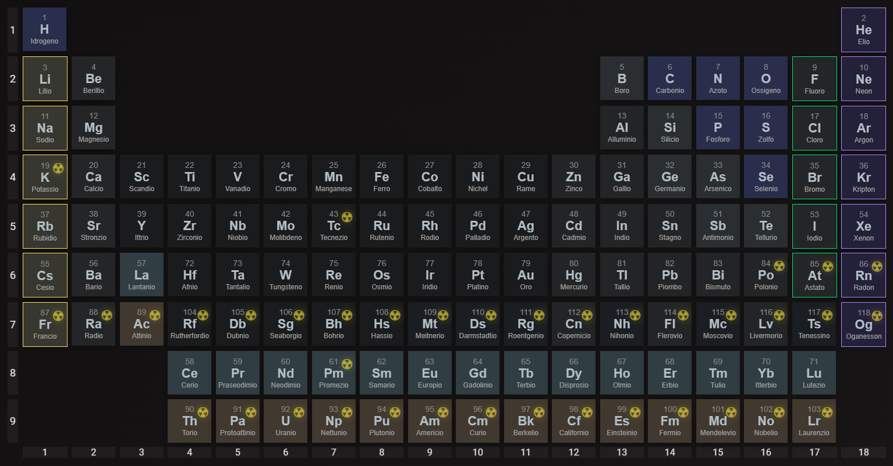
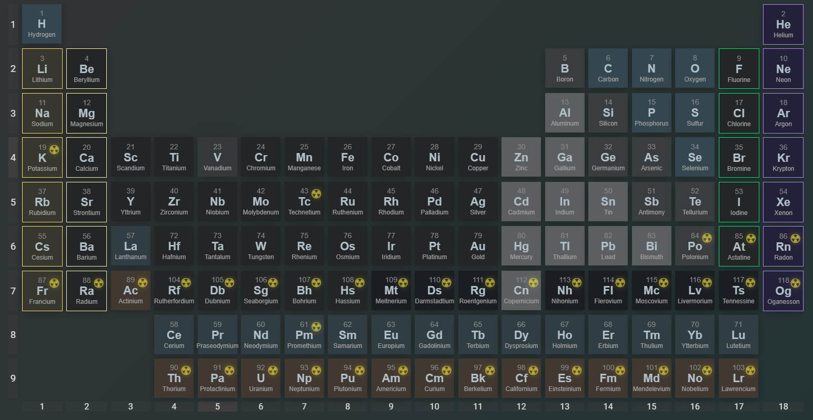
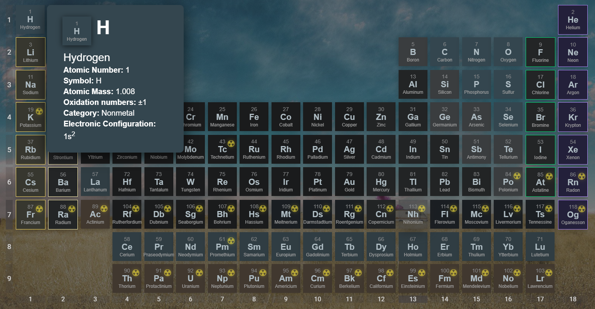

# Periodic Table of Elements

Non professional user made periodic table of elements

# Todo (list will update when every one is checked)
- add periods and groups without ruining the stlyes (done) - updated
- add advanced properties (done)
- ~~add isotopes table~~ - There are not many selectable ones, and including all would get the table to 3000+ cells, and days of research for the isotopes
- add basic explanation pages (2/8)
- theme and language saves - posted
- add costumization layer with local saves (half done)
- add mobile support (done) - posted (on device with screen < 800px it will show a block page
  - add on mobile devices (screen width < 800) a continue anyways button (some cheap phone does not have that resolution)

This repository contains a very simple periodic table containing elements from Hydrogen to Oganesson, including arrayed deatails as oxidation numbers, special electronic configuration, type and other properties, I will soon add more.

# Todo maybe
- Elements API (node js)
- add more external languages (Русский, Spanish) 

## License
Of course this is under MIT license.
[MIT](LICENSE)
